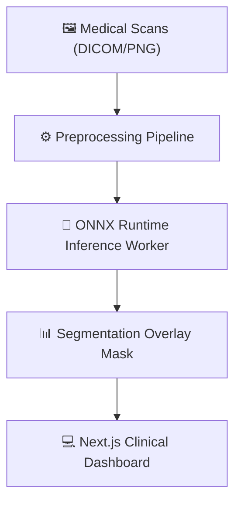
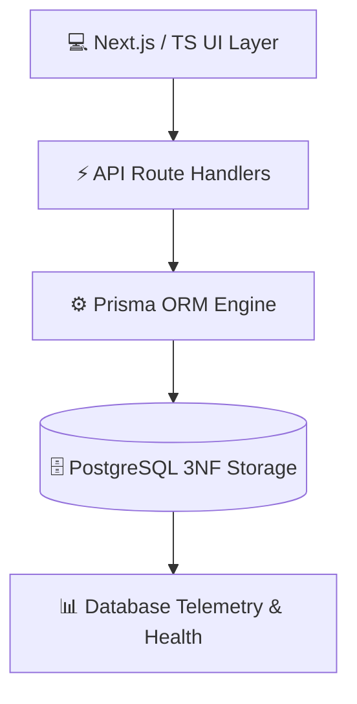
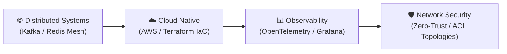

<!-- ========================================================================================= -->
<!--                    ⚡ FULL STACK & BACKEND SYSTEMS ARCHITECT // HERO ⚡                   -->
<!-- ========================================================================================= -->

<div align="center">

  <!-- Self-Hosted High-Resolution Animated SVG Banner -->
  

  <br/><br/>

  <!-- Modern Fira Code Terminal Typing Stream -->
  <a href="https://github.com/Cell1991">
    
  </a>

  <br/>

  <!-- SYSTEM STATUS BADGES -->
  <p align="center">
    
    
    
    
    
  </p>

</div>

---

<!-- ========================================================================================= -->
<!--                    🍱 01. BENTO PROFILE & TECHNICAL ARSENAL 🍱                            -->
<!-- ========================================================================================= -->

### `✦` `01` // BENTO MATRIX & TECHNICAL ARSENAL

<div align="center">

  <!-- Self-Hosted Vector Bento Matrix -->
  

  <br/><br/>

  <!-- Skill Icons Grid -->
  <a href="https://skillicons.dev">
    
  </a>

</div>

<br/>

<table width="100%">
  <thead>
    <tr style="background-color: #030712; border: 1px solid #1e293b;">
      <th width="28%" align="left">🚀 Technical Domain</th>
      <th width="72%" align="left">⚡ Technologies & Frameworks</th>
    </tr>
  </thead>
  <tbody>
    <tr>
      <td><b>🌐 Frontend</b></td>
      <td>
        
        
        
        
        
      </td>
    </tr>
    <tr>
      <td><b>⚙️ Backend & APIs</b></td>
      <td>
        
        
        
        
      </td>
    </tr>
    <tr>
      <td><b>🗄️ Database</b></td>
      <td>
        
        
        
      </td>
    </tr>
    <tr>
      <td><b>☁️ DevOps & Cloud</b></td>
      <td>
        
        
        
        
        
      </td>
    </tr>
    <tr>
      <td><b>📡 Networking</b></td>
      <td>
        
        
        
        
      </td>
    </tr>
    <tr>
      <td><b>📊 Data & Analytics</b></td>
      <td>
        
        
        
        
      </td>
    </tr>
  </tbody>
</table>

---

<!-- ========================================================================================= -->
<!--            🧬 02. OBJECT-ORIENTED SYSTEM ARCHITECTURE (ENTERPRISE TS) 🧬                  -->
<!-- ========================================================================================= -->

### `✦` `02` // OBJECT-ORIENTED SYSTEM ARCHITECTURE (`SYSTEM.CORE.TS`)

```typescript
/**
 * @module Architecture/CorePlatform
 * @description Enterprise OOP controller modeling developer stack capabilities
 */

export interface ICloudInfrastructure {
  provisionContainers(): Promise<"Docker Compose Multi-Service Mesh">;
  deployToCluster(environment: "AWS_EC2" | "Linux_Host"): Promise<boolean>;
}

export interface INetworkEngineering {
  analyzeTraffic(tool: "Wireshark" | "Nmap"): Observable<"Packet Inspection">;
  configureRoutingTopology(protocol: "Static" | "RIPv2", aclSecurity: boolean): void;
}

export interface IRelationalDataArchitecture {
  migrateSchema(orm: "Prisma"): Promise<"3NF Relational Schemas">;
  getTelemetry(): { queryLatency: "< 5ms"; poolState: "Optimal" };
}

export class SystemPlatformEngine implements ICloudInfrastructure, INetworkEngineering, IRelationalDataArchitecture {
  private static instance: SystemPlatformEngine;

  public static getInstance(): SystemPlatformEngine {
    return (this.instance ??= new SystemPlatformEngine());
  }

  public async provisionContainers() { return "Docker Compose Multi-Service Mesh" as const; }
  public async deployToCluster(env: "AWS_EC2" | "Linux_Host") { return true; }
  public analyzeTraffic(tool: "Wireshark" | "Nmap") { return of("Packet Inspection"); }
  public configureRoutingTopology(protocol: "Static" | "RIPv2", acl: boolean) {}
  public async migrateSchema(orm: "Prisma") { return "3NF Relational Schemas" as const; }
  public getTelemetry() { return { queryLatency: "< 5ms", poolState: "Optimal" }; }
}
```

---

<!-- ========================================================================================= -->
<!--            📐 03. ENGINEERING ARCHITECTURES & CASE STUDIES 📐                             -->
<!-- ========================================================================================= -->

### `✦` `03` // ENGINEERING ARCHITECTURES & CASE STUDIES

<!-- PROJECT 1: CROSSWORD GAME -->
#### 🎮 01 // Real-Time Multiplayer Crossword Engine

<div align="center">
  <p>
    
    
    
  </p>

  <!-- Vector Architecture Diagram -->
  
</div>

- **Real-Time Room Orchestration:** Low-latency player synchronization, custom room session management, and state broadcasting.
- **Algorithmic Board Engine:** Dynamic 2D matrix crossword generator validated against curated vocabulary datasets.
- **Microservice Isolation:** Multi-container deployment managed via Docker Compose.

<p align="left">
  <a href="https://github.com/Cell1991/crossword-game">
    
  </a>
</p>

<br/>

<!-- PROJECT 2 & 3: MERMAID ARCHITECTURES -->
<table>
  <tr>
    <td width="50%" valign="top" style="background-color: #030712; border: 1px solid #1e293b; border-radius: 10px; padding: 14px;">
      <h4 style="color: #c084fc;">🧠 02 // NU Stroke Scan (Medical AI Pipeline)</h4>
      <p>
        
        
        
      </p>



      <ul>
        <li><b>High-Throughput Inference:</b> Embedded ONNX Runtime in FastAPI for rapid batch image segmentation.</li>
        <li><b>Clinical UI:</b> Secure DICOM upload interface with real-time mask overlay rendering.</li>
      </ul>
      <a href="https://github.com/Cell1991/nu-stroke-scan">
        
      </a>
    </td>

    <td width="50%" valign="top" style="background-color: #030712; border: 1px solid #1e293b; border-radius: 10px; padding: 14px;">
      <h4 style="color: #38bdf8;">🩺 03 // Wellness Enterprise Data Platform</h4>
      <p>
        
        
        
      </p>



      <ul>
        <li><b>Relational 3NF Architecture:</b> Strictly normalized entity modeling with Prisma migrations.</li>
        <li><b>Telemetry Monitoring:</b> Query latency tracking, connection pool diagnostics, and QA tests.</li>
      </ul>
      
    </td>
  </tr>
</table>

---

<!-- ========================================================================================= -->
<!--             🏆 04. HONORS, HACKATHONS & RECOGNITION 🏆                                    -->
<!-- ========================================================================================= -->

### `✦` `04` // HONORS, HACKATHONS & KEY RECOGNITION

<table width="100%">
  <thead>
    <tr style="background-color: #030712; border: 1px solid #1e293b;">
      <th width="18%" align="center">🎖️ Award</th>
      <th width="42%" align="left">🚀 Event & Competition</th>
      <th width="40%" align="left">⭐ Competency Highlight</th>
    </tr>
  </thead>
  <tbody>
    <tr>
      <td align="center"></td>
      <td><b>LINE Hackathon</b></td>
      <td>Rapid microservice engineering & LINE API integration under strict timeline.</td>
    </tr>
    <tr>
      <td align="center"></td>
      <td><b>Anthropocene Smart Medication Box</b></td>
      <td>IoT-to-Cloud telemetry, backend tracking APIs & hardware integration.</td>
    </tr>
    <tr>
      <td align="center"></td>
      <td><b>Data Visualization Challenge</b></td>
      <td>Statistical data extraction, ETL pipelines & Power BI dashboards.</td>
    </tr>
    <tr>
      <td align="center"></td>
      <td><b>Competitive Programming Contest</b></td>
      <td>Data structures, algorithmic optimization & dynamic programming.</td>
    </tr>
    <tr>
      <td align="center"></td>
      <td><b>CSIT Teaching Assistant & Volunteer</b></td>
      <td>Mentoring undergraduate students in C++/Python & Computer Networking.</td>
    </tr>
  </tbody>
</table>

---

<!-- ========================================================================================= -->
<!--          📊 05. GITHUB ANALYTICS & CODE ACTIVITY MATRIX 📊                                -->
<!-- ========================================================================================= -->

### `✦` `05` // GITHUB ANALYTICS & CODE ACTIVITY MATRIX

<div align="center">

  <table border="0" cellspacing="0" cellpadding="0">
    <tr>
      <td align="center" valign="middle">
        
      </td>
      <td align="center" valign="middle">
        
      </td>
    </tr>
    <tr>
      <td colspan="2" align="center" valign="middle">
        <br/>
        
      </td>
    </tr>
  </table>

</div>

---

<!-- ========================================================================================= -->
<!--              🧭 06. RESEARCH HORIZON & ENGINEERING ROADMAP 🧭                             -->
<!-- ========================================================================================= -->

### `✦` `06` // RESEARCH HORIZON & ENGINEERING ROADMAP



---

<!-- ========================================================================================= -->
<!--             📬 07. COMMUNICATIONS & COLLABORATION HUB 📬                                  -->
<!-- ========================================================================================= -->

<div align="center">

### `✦` `07` // CONNECT & COLLABORATE

<p align="center">
  <a href="https://github.com/Cell1991">
    
  </a>
  &nbsp;&nbsp;
  <a href="mailto:celleb1991@gmail.com">
    
  </a>
</p>

<!-- Self-Hosted High-Resolution SVG Footer -->


</div>
