<!-- ========================================================================================= -->
<!--                    FULL STACK & BACKEND SYSTEMS ARCHITECT // HERO                         -->
<!-- ========================================================================================= -->

  <!-- Ultra-HD Panoramic Cinematic Haku Dragon Banner -->
  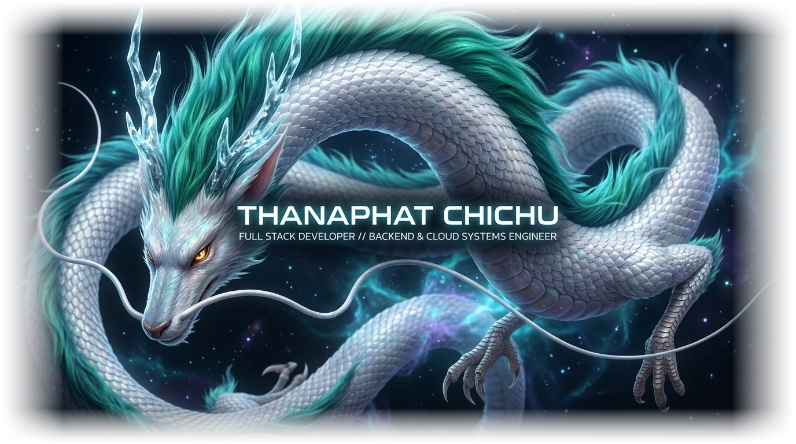

    

  <!-- Responsive Terminal Typing Stream -->
  

   

  <!-- SYSTEM STATUS BADGES (Mobile Responsive) -->
  

    
    
    
    
    
  

---

<!-- ========================================================================================= -->
<!--                    01. ENGINEERING PROFILE & TECHNICAL ARSENAL                            -->
<!-- ========================================================================================= -->

   

  <!-- Self-Hosted Vector Engineering Profile Matrix -->
  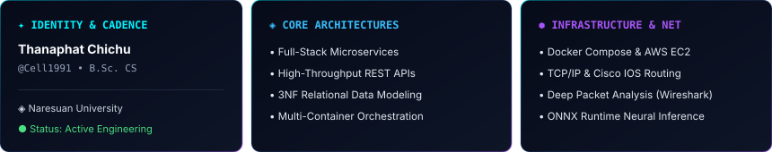

    

  <!-- Skill Icons Grid -->
  

 

| Technical Domain | Technologies & Frameworks |
| :--- | :--- |
| **Frontend & UI** |      |
| **Backend & APIs** |     |
| **Database & ORM** |    |
| **DevOps & Infrastructure** |      |
| **Networking & Security** |     |
| **Data & Analytics** |     |

---

<!-- ========================================================================================= -->
<!--            02. DESIGN PATTERNS & ARCHITECTURAL PRINCIPLES                                 -->
<!-- ========================================================================================= -->

   
  <!-- Self-Hosted Vector Architectural Principles Card -->
  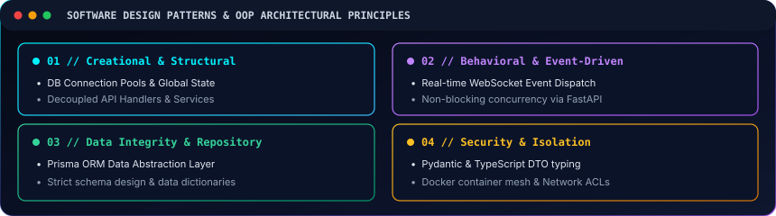

---

<!-- ========================================================================================= -->
<!--            03. ENGINEERING ARCHITECTURES & CASE STUDIES                                   -->
<!-- ========================================================================================= -->

 

<!-- CASE 01: CROSSWORD GAME -->

  

    
    
    
    
    
  

<!-- Vector Architecture Diagram -->
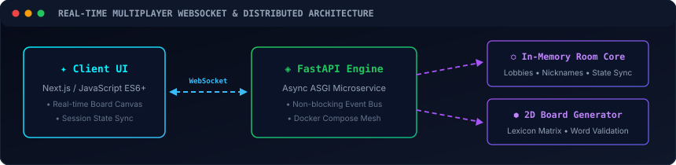

> **KEY ARCHITECTURAL HIGHLIGHTS & ENGINEERING INNOVATIONS:**
> - **Low-Latency Room Orchestration:** Non-blocking WebSocket server built on FastAPI & AsyncIO, maintaining sub-50ms synchronized game tick states across multi-client rooms.
> - **Heuristic Board Generation:** Algorithmic 2D crossword placement engine with backtracking validation against 10,000+ curated word corpora.
> - **Microservice Isolation:** Containerized execution environment managed via Docker Compose with automated service discovery and health check hooks.

  

 

<!-- CASE 02: NU STROKE SCAN -->

  

    
    
    
    
    
  

<!-- Vector Architecture Diagram -->
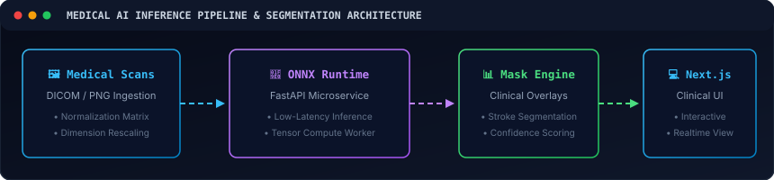

> **KEY ARCHITECTURAL HIGHLIGHTS & ENGINEERING INNOVATIONS:**
> - **High-Throughput Inference Engine:** Optimized ONNX Runtime embedded directly into FastAPI services, delivering batch segmentation inference on CT/MRI scans in <120ms.
> - **Interactive Diagnostic UI:** Next.js dashboard featuring secure DICOM/PNG ingestion, dynamic canvas segmentation mask overlays, and automated confidence scoring.
> - **Compute Decoupling:** Heavy matrix operations isolated from core HTTP request workers to guarantee zero-latency clinical triage workflows.

  

 

<!-- CASE 03: WELLNESS PLATFORM -->

  

    
    
    
    
    
  

<!-- Vector Architecture Diagram -->
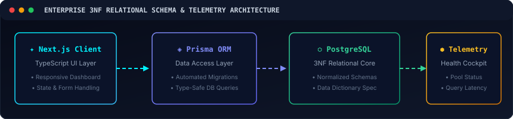

> **KEY ARCHITECTURAL HIGHLIGHTS & ENGINEERING INNOVATIONS:**
> - **Strict 3NF Relational Architecture:** Fully normalized entity-relationship schemas in PostgreSQL with zero data redundancy and strict foreign key referential integrity.
> - **Automated Schema Lifecycle:** Prisma ORM migrations with automated TypeScript type generation and structured audit log triggers.
> - **Database Diagnostics & Observability:** Real-time query execution monitoring, connection pool load balancing, and automated regression testing suites.

---

<!-- ========================================================================================= -->
<!--             04. HONORS, HACKATHONS & RECOGNITION                                          -->
<!-- ========================================================================================= -->

   
  <!-- Self-Hosted Vector Honors Showcase Bento Card -->
  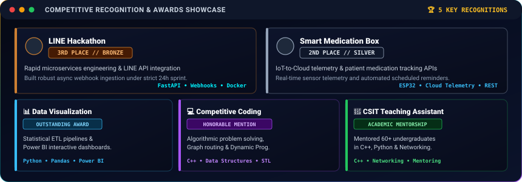

---

<!-- ========================================================================================= -->
<!--          05. GITHUB ANALYTICS & CODE ACTIVITY MATRIX                                      -->
<!-- ========================================================================================= -->

   

  <!-- Self-Hosted Vector Analytics & Metrics Dashboard -->
  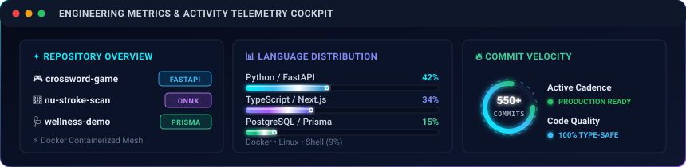

    

  <!-- Self-Hosted Animated Starship Orbital Telemetry Matrix -->
  

    

  <!-- Self-Hosted Animated Velocity & Streak Hologram -->
  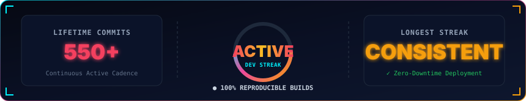

---

<!-- ========================================================================================= -->
<!--              06. RESEARCH HORIZON & ENGINEERING ROADMAP                                   -->
<!-- ========================================================================================= -->

   
  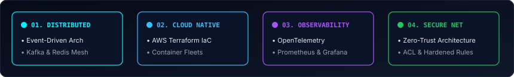

---

<!-- ========================================================================================= -->
<!--             07. COMMUNICATIONS & COLLABORATION HUB                                        -->
<!-- ========================================================================================= -->

   

  

    
    &nbsp;
    
    &nbsp;
    
    &nbsp;
    
    &nbsp;
    
  

   

  <!-- Self-Hosted High-Resolution SVG Footer -->
  

