<!-- ========================================================================================= -->
<!--                    ⚡ FULL STACK & BACKEND SYSTEMS ARCHITECT // HERO ⚡                   -->
<!-- ========================================================================================= -->

  <!-- Self-Hosted High-Resolution Animated SVG Banner -->
  

    

  <!-- Responsive Terminal Typing Stream -->
  

   

  <!-- SYSTEM STATUS BADGES (Mobile Responsive) -->
  

    
    
    
    
    
  

---

<!-- ========================================================================================= -->
<!--                    🍱 01. BENTO PROFILE & TECHNICAL ARSENAL 🍱                            -->
<!-- ========================================================================================= -->

### `✦` `01` // BENTO MATRIX & TECHNICAL ARSENAL

  <!-- Self-Hosted Vector Bento Matrix -->
  

    

  <!-- Skill Icons Grid -->
  

 

| Technical Domain | Technologies & Frameworks |
| :--- | :--- |
| **🌐 Frontend** |      |
| **⚙️ Backend & APIs** |     |
| **🗄️ Database** |    |
| **☁️ DevOps & Cloud** |      |
| **📡 Networking** |     |
| **📊 Data & Analytics** |     |

---

<!-- ========================================================================================= -->
<!--            🧬 02. DESIGN PATTERNS & ARCHITECTURAL PRINCIPLES 🧬                           -->
<!-- ========================================================================================= -->

### `✦` `02` // DESIGN PATTERNS & ARCHITECTURAL PRINCIPLES

  <!-- Self-Hosted Vector Architectural Principles Card -->
  

---

<!-- ========================================================================================= -->
<!--            📐 03. ENGINEERING ARCHITECTURES & CASE STUDIES 📐                             -->
<!-- ========================================================================================= -->

### `✦` `03` // ENGINEERING ARCHITECTURES & CASE STUDIES

<!-- CASE 01: CROSSWORD GAME -->

  <h3>🎮 01 // Multiplayer Real-Time Crossword Engine</h3>
  

    
    
    
    
  

<!-- Vector Architecture Diagram -->

<ul>
  <li><b>Real-Time Room Orchestrator:</b> Low-latency player synchronization, custom session manager, and non-blocking game ticks.</li>
  <li><b>Algorithmic Board Generator:</b> Dynamic 2D matrix crossword solver validated in real-time against curated vocabulary datasets.</li>
  <li><b>Containerized Deployment:</b> Fully isolated microservices orchestrated using Docker Compose definitions.</li>
</ul>

  

 

<!-- CASE 02: NU STROKE SCAN -->

  <h3>🧠 02 // NU Stroke Scan (Medical AI Inference Pipeline)</h3>
  

    
    
    
    
  

<!-- Vector Architecture Diagram -->

<ul>
  <li><b>High-Throughput Inference:</b> Embedded ONNX Runtime in FastAPI for low-latency batch matrix inference on medical scans.</li>
  <li><b>Clinical UI Layer:</b> Interactive Next.js dashboard featuring secure DICOM/image uploading and real-time segmentation mask rendering.</li>
  <li><b>Decoupled Architecture:</b> Worker isolation separating heavy matrix computations from client request handlers.</li>
</ul>

  

 

<!-- CASE 03: WELLNESS PLATFORM -->

  <h3>🩺 03 // Wellness Enterprise Data Platform</h3>
  

    
    
    
    
  

<!-- Vector Architecture Diagram -->

<ul>
  <li><b>3NF Database Architecture:</b> Strictly normalized entity modeling in PostgreSQL with automated Prisma migrations and data dictionaries.</li>
  <li><b>Telemetry Monitoring:</b> Query latency tracking, connection pool health diagnostics, and automated testing suites.</li>
</ul>

---

<!-- ========================================================================================= -->
<!--             🏆 04. HONORS, HACKATHONS & RECOGNITION 🏆                                    -->
<!-- ========================================================================================= -->

### `✦` `04` // HONORS, HACKATHONS & KEY RECOGNITION

- 🥉 **LINE Hackathon** `3rd Place // Bronze Award`  
  *Rapid microservice engineering & LINE API integration under strict timeline.*

- 🥈 **Anthropocene Smart Medication Box** `2nd Place // Silver Award`  
  *IoT-to-Cloud telemetry, backend tracking APIs & hardware integration.*

- 📊 **Data Visualization Challenge** `Outstanding Award`  
  *Statistical data extraction, ETL pipelines & Power BI dashboards.*

- 💻 **Competitive Programming Contest** `Honorable Mention`  
  *Data structures, algorithmic optimization & dynamic programming.*

- 🤝 **CSIT Teaching Assistant & Volunteer** `Leadership & Mentorship`  
  *Mentoring undergraduate students in C++/Python & Computer Networking.*

---

<!-- ========================================================================================= -->
<!--          📊 05. GITHUB ANALYTICS & CODE ACTIVITY MATRIX 📊                                -->
<!-- ========================================================================================= -->

### `✦` `05` // GITHUB ANALYTICS & CODE ACTIVITY MATRIX

  <!-- Self-Hosted Vector Analytics & Metrics Dashboard -->
  

    

  <!-- Self-Hosted Animated Starship Orbital Telemetry Matrix -->
  

    

  <!-- Self-Hosted Animated Velocity & Streak Hologram -->
  

---

<!-- ========================================================================================= -->
<!--              🧭 06. RESEARCH HORIZON & ENGINEERING ROADMAP 🧭                             -->
<!-- ========================================================================================= -->

### `✦` `06` // RESEARCH HORIZON & ENGINEERING ROADMAP

  

---

<!-- ========================================================================================= -->
<!--             📬 07. COMMUNICATIONS & COLLABORATION HUB 📬                                  -->
<!-- ========================================================================================= -->

### `✦` `07` // CONNECT & COLLABORATE

  
  &nbsp;&nbsp;
  

<!-- Self-Hosted High-Resolution SVG Footer -->

